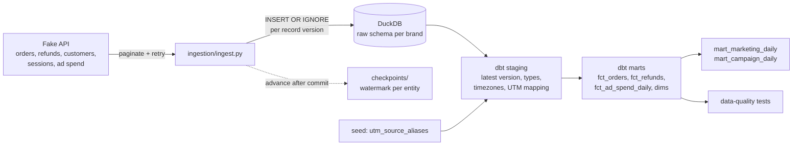

# Marketing Data Reliability Pipeline

A small but complete pipeline that answers the question every e-commerce operator asks: **for every dollar we spent on ads, how much real revenue came back?**

It ingests daily ad spend from Meta and Google alongside the store's own orders and refunds, cleans up inconsistent campaign and UTM naming, and reconciles spend against the revenue the store actually kept. The outputs are MER, ROAS, AOV and new-customer CAC that can be trusted.

> This project runs on **synthetic data** served by a **fake paginated API** (`source/`). It's not a live Shopify or ad-platform integration. The fake API behaves like the real ones in the ways that matter here: it paginates, rate-limits, fails intermittently, repeats records, delivers some data late, and restates spend after the fact.

## Why this is harder than it looks

- **Platforms over-claim.** Meta and Google each take credit for the same sale, so summing platform-reported revenue overstates it. In the demo data, platform-reported revenue is higher than the store's total revenue.
- **Tagging is done by hand.** One brand ends up with `facebook`, `FB`, ` Facebook `, `fb.com` and `IG` all meaning the same platform, plus blank and missing UTMs.
- **Numbers change after the fact.** Refunds arrive weeks later, ad platforms restate spend for a few days, and some records reach the API late.
- **Days don't line up.** Orders are timestamped in UTC, while ad platforms report in the account's local day.

## Architecture



Data flows from synthetic ad and order APIs into raw DuckDB tables, then through dbt staging and marts for reporting and quality checks.

Every brand is a separate tenant: `raw_<brand>`, `<brand>_staging` and `<brand>_marts` in one DuckDB file, with dbt run once per brand.

## Project structure

```
config.py                 brands, entities, page size, retry and lookback settings
run_pipeline.py           runs ingestion + dbt; --demo replays three runs from scratch
source/
  generate.py             synthetic orders, refunds, sessions and ad spend (with realistic mess)
  fake_api.py             paginated, unreliable API over the synthetic data
ingestion/
  ingest.py               pagination, retries, idempotent raw loads, checkpoints
transform/                dbt project (DuckDB)
  seeds/                  utm_source_aliases.csv: the single place source names are mapped
  macros/                 latest_version, clean_text, per-tenant schema naming
  models/staging/         one model per source entity
  models/marts/           facts, dimensions and the two reporting marts
  tests/                  business-rule tests (reconciliation, unmapped revenue, ...)
tests/                    pytest suite for the ingestion layer
```

## Running it

Requires Python 3.11+.

```bash
python -m venv .venv && source .venv/bin/activate
pip install -r requirements.txt

python run_pipeline.py --demo   # wipe data/, generate, three incremental runs, idempotency check
python -m pytest                # ingestion tests
```

The demo takes about a minute and ends with a summary per brand. After that:

```bash
python run_pipeline.py                                      # pick up anything new, rebuild marts
python -m ingestion.ingest --as-of 2026-08-15T00:00:00Z     # ingestion only, as of a point in time
dbt build --project-dir transform --profiles-dir transform \
  --vars '{brand: acme_apparel, reporting_tz: America/New_York}'
```

Run commands from the repository root. The warehouse is `data/warehouse.duckdb`, and you can open it with the `duckdb` CLI or Python to explore the marts.

## Metrics

| Metric | Definition | Where |
|---|---|---|
| Spend | Current (restated) ad spend | both marts |
| Gross revenue | Subtotal − discounts, excluding tax and shipping | both marts |
| Net revenue | Gross revenue − refunds, with refunds dated to the **original order** | both marts |
| AOV | Gross revenue ÷ orders | `mart_marketing_daily` |
| MER | Net revenue ÷ total spend (blended). **The headline number** | `mart_marketing_daily` |
| New-customer CAC | Total spend ÷ customers placing their first order | `mart_marketing_daily` |
| ROAS | Last-click attributed net revenue ÷ campaign spend | `mart_campaign_daily` |
| CPA, conversion rate | Spend ÷ attributed orders; attributed orders ÷ clicks | `mart_campaign_daily` |
| Platform-reported ROAS | What Meta/Google claim, kept alongside for comparison only | `mart_campaign_daily` |

Every ratio returns NULL rather than 0 when its denominator is zero. A day with no spend has no MER; it doesn't have an MER of 0.

## Design decisions

**Internal orders are the source of truth for revenue.** Platform conversions are stored in separate `platform_reported_*` columns and never added to revenue. MER is the number to steer by because both sides of it are complete and deduplicated. Per-campaign ROAS is useful for comparing campaigns with each other, but it's directional: last-click can't see view-through or cross-device conversions.

**Raw is append-only and keyed on version.** Each raw row is one version of one record, with primary key `(id, updated_at)`. Loading the same version twice is a no-op (`INSERT OR IGNORE`), and a corrected record lands as a new row. Raw is never updated, so every downstream model can be rebuilt from it. Staging picks the latest version per id.

**Incremental ingestion with a watermark and a lookback.** Each brand × entity has a checkpoint holding the highest `updated_at` loaded. The next run requests `updated_at >= watermark − lookback`. The `>=` means records that share the watermark's timestamp aren't skipped. The lookback (1–7 days, per entity in `config.py`) catches records that show up late with an older timestamp. The overlap costs nothing because the load is idempotent.

**The checkpoint moves only after a committed load.** Each entity loads in one transaction. If a run fails partway, the transaction rolls back and the watermark stays put, so the next run simply repeats the same window. Writing the checkpoint first would turn a crash into silent data loss.

**Retries distinguish the kind of failure.** A 429 waits for `retry_after`. A 503 backs off exponentially with jitter. A 400 fails immediately, because retrying a bad request only hides a bug. When retries run out, the error is raised; a page is never silently skipped.

**Refunds are attributed to the order date.** A day's net revenue reflects the orders placed that day, which is what you need to judge that day's spend. The cost is that recent days aren't final until the refund window has passed. That's why the marts are rebuilt in full rather than incrementally.

**Source names are mapped in one place.** `seeds/utm_source_aliases.csv` maps every known spelling to a canonical platform after `clean_text` (lowercase, trim, blank → NULL). Unknown sources become `unmapped` and missing ones become `direct`; revenue is never dropped and the platform is never guessed. Campaigns join on `campaign_id` (`utm_id`), never on name. When a session carries a campaign id, the campaign's platform wins over whatever the `utm_source` says.

**One incremental model, where it pays off.** `fct_ad_spend_daily` is incremental, and each run rebuilds the last 7 days to absorb restatements. A reconciliation test fails the build if its totals ever drift from current source spend. The other marts are small, so full rebuilds are simpler and always correct.

**Timezones are handled explicitly.** Orders are converted from UTC to each brand's `reporting_tz` before being bucketed into days. Ad spend already arrives in local dates. Mixing the two is a classic silent ROAS bug: late-evening orders land on the wrong day.

## Data-quality checks

On top of `unique` / `not_null` / `relationships` / `accepted_values` on every key:

| Test | Severity | Catches |
|---|---|---|
| `assert_marts_reconcile_to_sources` | error | Spend and revenue in the marts don't add up to the source facts (fan-out joins, missed restatements) |
| `assert_unmapped_revenue_share_below_threshold` | error | More than 3% of revenue from an unmapped utm_source, meaning a new source needs mapping |
| `assert_refunds_do_not_exceed_order_value` | error | Refunds larger than the order |
| `assert_spend_is_not_negative` | error | Bad spend values |
| `currency` accepted values | error | A non-USD order, instead of summing mixed currencies |
| `stg_sessions.campaign_id` relationship | error | Sessions claiming campaigns the ad platforms don't know |
| `assert_unattributed_revenue_share_stable` | warn | A sudden jump in no-UTM revenue, which usually means tracking broke. The synthetic data includes a two-day tracking outage for `bloom_skin` (Aug 20–21), so this warning is expected to fire on exactly those two days |
| `assert_ad_spend_restatements_within_tolerance` | warn | Spend restated by more than 25% |

The Python tests (`tests/`) cover pagination ending, retryable vs fatal errors, backoff, idempotent reloads, duplicates within a batch, rollback on bad records, the checkpoint not moving on failure, and the lookback catching late records (and missing them with no lookback).

## Edge cases handled

- Spelling variants, extra whitespace, blank strings and missing UTMs
- Sources nobody has mapped yet, which are surfaced rather than dropped
- Missing and padded campaign names; the latest known name is kept per campaign id
- The same record returned twice across pages, and the same batch loaded twice
- Orders changing after creation (fulfilled, refunded), and ad spend restated days later
- Records that arrive after their `updated_at` has already passed the watermark
- Full and partial refunds up to 20 days after the order
- UTC order timestamps vs local-date ad reporting, for brands in two timezones
- A storefront tracking outage, where UTMs disappear for two days

## Assumptions

- One currency (USD) per brand. The build fails on anything else.
- Ad accounts report in the brand's reporting timezone.
- Attribution is last-click via the order's landing session.
- A cancelled order is treated as a full refund.
- Revenue excludes tax and shipping.
- The lookback windows (7 days for spend, 3 for orders and refunds) cover the source's correction and late-delivery behaviour. The reconciliation test is the safety net if that stops being true.

## Future improvements

- Campaign name history as an SCD Type 2 dimension
- Proactive alerting: compare each day's MER, CAC and unattributed share against a trailing baseline and push the anomaly, with the rows behind it
- Orchestration (Dagster or similar) with per-brand partitions and backfills
- Real connectors (Shopify Admin API, Meta Marketing API, Google Ads API)
- Click-ID stitching (`gclid`, `fbclid`), view-through and multi-touch attribution, MMM, cross-device identity. These depend on platform capabilities and privacy constraints and are deliberately out of scope.
- Multi-currency with FX conversion, subscription churn and chargebacks, and modelling privacy-driven reporting delays
