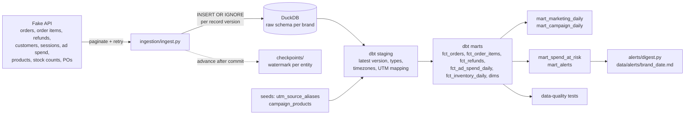

# Marketing Data Reliability Pipeline

A small but complete pipeline that answers the question every e-commerce operator asks: **for every dollar we spent on ads, how much real revenue came back?**

It ingests daily ad spend from Meta and Google alongside the store's own orders and refunds, cleans up inconsistent campaign and UTM naming, and reconciles spend against the revenue the store actually kept. The outputs are MER, ROAS, AOV and new-customer CAC that can be trusted.

It then asks the follow-up question that ROAS can't answer: **are we spending that money on something we're about to run out of?** Stock counts, line items and purchase orders feed a spend-at-risk mart and an alert digest, so a campaign burning budget on a SKU with four days of cover shows up before the stockout, not after.

> This project runs on **synthetic data** served by a **fake paginated API** (`source/`). It's not a live Shopify or ad-platform integration. The fake API behaves like the real ones in the ways that matter here: it paginates, rate-limits, fails intermittently, repeats records, delivers some data late, and restates spend after the fact.

## Why this is harder than it looks

- **Platforms over-claim.** Meta and Google each take credit for the same sale, so summing platform-reported revenue overstates it. In the demo data, platform-reported revenue is higher than the store's total revenue.
- **Tagging is done by hand.** One brand ends up with `facebook`, `FB`, ` Facebook `, `fb.com` and `IG` all meaning the same platform, plus blank and missing UTMs.
- **Numbers change after the fact.** Refunds arrive weeks later, ad platforms restate spend for a few days, and some records reach the API late.
- **Days don't line up.** Orders are timestamped in UTC, while ad platforms report in the account's local day.

## Architecture


```mermaid
flowchart LR
    A[Fake API<br/>orders, order items, refunds,<br/>customers, sessions, ad spend,<br/>products, stock counts, POs] -->|paginate + retry| B[ingestion/ingest.py]
    B -->|INSERT OR IGNORE<br/>per record version| C[(DuckDB<br/>raw schema per brand)]
    B -. advance after commit .-> K[checkpoints/<br/>watermark per entity]
    C --> D[dbt staging<br/>latest version, types,<br/>timezones, UTM mapping]
    S[seeds: utm_source_aliases<br/>campaign_products] --> D
    D --> E[dbt marts<br/>fct_orders, fct_order_items, fct_refunds,<br/>fct_ad_spend_daily, fct_inventory_daily, dims]
    E --> F[mart_marketing_daily<br/>mart_campaign_daily]
    E --> G[mart_spend_at_risk<br/>mart_alerts]
    G --> H[alerts/digest.py<br/>data/alerts/brand_date.md]
    E --> T[data-quality tests]
```

Data flows from synthetic ad and order APIs into raw DuckDB tables, then through dbt staging and marts for reporting and quality checks.

Every brand is a separate tenant: `raw_<brand>`, `<brand>_staging` and `<brand>_marts` in one DuckDB file, with dbt run once per brand.

## Project structure

```
config.py                 brands, entities, page size, retry and lookback settings
run_pipeline.py           runs ingestion + dbt + the digest; --demo replays three runs from scratch
source/
  generate.py             synthetic orders, line items, stock, POs and ad spend (with realistic mess)
  fake_api.py             paginated, unreliable API over the synthetic data
ingestion/
  ingest.py               pagination, retries, idempotent raw loads, checkpoints
transform/                dbt project (DuckDB)
  seeds/                  utm_source_aliases.csv (source name mapping)
                          campaign_products.csv (which SKUs each campaign promotes)
  macros/                 latest_version, clean_text, per-tenant schema naming
  models/staging/         one model per source entity
  models/marts/           facts, dimensions, the reporting marts, spend-at-risk and alerts
  tests/                  business-rule tests (reconciliation, unmapped revenue, ...)
alerts/
  digest.py               turns mart_alerts into a Markdown note per brand per day
tests/                    pytest suite for ingestion, plus the stockout scenario end to end
```

## Running it

Requires Python 3.11+.

```bash
python -m venv .venv && source .venv/bin/activate
pip install -r requirements.txt

python run_pipeline.py --demo   # wipe data/, generate, three incremental runs, idempotency check
python -m pytest                # 23 tests: ingestion, plus the stockout scenario end to end
```

The demo takes three or four minutes (nine entities, three runs, two brands), ends with a summary per brand, and writes an alert digest to `data/alerts/`. After that:

```bash
python run_pipeline.py                                      # pick up anything new, rebuild marts
python -m ingestion.ingest --as-of 2026-08-15T00:00:00Z     # ingestion only, as of a point in time
python -m alerts.digest                                     # rewrite the digests from the marts
dbt build --project-dir transform --profiles-dir transform \
  --vars '{brand: acme_apparel, reporting_tz: America/New_York}'
```

Run commands from the repository root. The warehouse is `data/warehouse.duckdb`, and you can open it with the `duckdb` CLI or Python to explore the marts.

## Metrics

| Metric | Definition | Where |
|---|---|---|
| Spend | Current (restated) ad spend | both marts |
| Gross revenue | Subtotal − discounts, excluding tax and shipping | both marts |
| Net revenue | Gross revenue − refunds, with refunds dated to the **original order** | both marts |
| AOV | Gross revenue ÷ orders | `mart_marketing_daily` |
| MER | Net revenue ÷ total spend (blended). **The headline number** | `mart_marketing_daily` |
| New-customer CAC | Total spend ÷ customers placing their first order | `mart_marketing_daily` |
| ROAS | Last-click attributed net revenue ÷ campaign spend | `mart_campaign_daily` |
| CPA, conversion rate | Spend ÷ attributed orders; attributed orders ÷ clicks | `mart_campaign_daily` |
| Platform-reported ROAS | What Meta/Google claim, kept alongside for comparison only | `mart_campaign_daily` |

Every ratio returns NULL rather than 0 when its denominator is zero. A day with no spend has no MER; it doesn't have an MER of 0.

## Inventory-aware spend and alerts

Ad spend and stock are the same problem. A campaign performs, so it keeps spending, but the SKU it promotes is about to sell out. Orders still arrive, they go on backorder, and two weeks later a chunk of those customers cancel. You paid for clicks that turned into refunds, and per-campaign ROAS looked fine the whole time, because the revenue was booked before the cancellation.

This half of the pipeline answers one question — *which campaign is spending money on something we're about to run out of?* — and answers it before the stockout rather than after.

### The metrics

| Metric | Definition | Where |
|---|---|---|
| Units sold | Units ordered per SKU per day, including units that went on backorder | `fct_inventory_daily` |
| On hand | Units in the warehouse at close of business | `fct_inventory_daily` |
| Velocity (14d) | Trailing average units sold per day, ending the day before | `fct_inventory_daily` |
| Days of cover | On hand ÷ velocity. NULL when velocity is 0 | `fct_inventory_daily` |
| Projected stockout date | Snapshot date + days of cover | `fct_inventory_daily` |
| Open PO units, next restock | Units on POs not yet received, and the earliest promised arrival | `fct_inventory_daily` |
| Reorder point | Velocity × (supplier lead time + `safety_days`) | `fct_inventory_daily` |
| Spend at risk | Campaign spend allocated to a SKU on a day that SKU is exposed | `mart_spend_at_risk` |
| Lost revenue | Line revenue on orders cancelled with reason `out_of_stock` | `mart_spend_at_risk` |

Campaign spend is split evenly across the SKUs a campaign promotes (`seeds/campaign_products.csv`), and a SKU's lost revenue is split the same way across the campaigns promoting it, so summing either column over rows still gives the real total.

### The alert rules

| Alert | Fires when | Threshold | Severity |
|---|---|---|---|
| `stockout_risk_with_active_spend` | The SKU still has stock, the campaign is spending on it, and it runs out before the next delivery | cover shorter than the wait for the next restock; or cover ≤ `stockout_alert_days` (7) when nothing is due | high under 3 days of cover, else medium |
| `spend_on_out_of_stock_sku` | On hand is 0 and the campaign still spent on it that day | any spend | high |
| `mer_drop` | 3-day MER is below its 14-day baseline | `mer_drop_threshold` 25%, needs ≥ 10 orders that day | high at 50%, else medium |
| `cac_spike` | 3-day new-customer CAC is above its 14-day baseline | `cac_spike_threshold` 35%, needs ≥ 5 new customers | high at 70%, else medium |

Thresholds are dbt vars in `transform/dbt_project.yml`, so tuning them is one edit rather than a hunt through SQL.

Two decisions worth explaining:

**The observed side is smoothed; only the baseline is long.** A single day's MER on twenty orders swings by a third on its own. Comparing one noisy day against a smooth 14-day baseline fires constantly, and an alerting layer that cries wolf gets muted within a week. So each rule compares a 3-day average against the trailing baseline, and each has a minimum-volume guard. On the demo data the smoothing takes `acme_apparel` from 14 MER alerts over two months down to 4.

**A promised delivery date that has already passed is not a delivery.** A PO stays open when the supplier misses its date, so `next_restock_date` can be in the past. `mart_spend_at_risk` only counts a restock that is still in the future, which means an overdue PO makes the SKU look unprotected — because it is.

### The push step

`alerts/digest.py` runs at the end of every pipeline run: it reads the most recent date in `mart_alerts` per brand, writes `data/alerts/<brand>_<date>.md`, and prints the most severe alerts. It uses the latest date in the data rather than the wall clock, because the synthetic sources stop at the end of August.

Slack and email delivery are deliberately not built. They need a credential, a retry policy and a deduplication rule of their own, and the part worth showing — deciding what is worth saying — is here.

### The scenario in the demo data

Each brand's data contains one deliberate failure, so the alerts have something real to catch:

| | acme_apparel | bloom_skin |
|---|---|---|
| Hero SKU | `TEE-BLK-M` | `SERUM-VITC-30` |
| Campaign that keeps spending | Summer_Sale, ~$314/day | Summer_Sale, ~$307/day |
| Out of stock | Aug 13 – Aug 27 | Aug 12 – Aug 27 |
| Replacement PO | promised Aug 24, arrived Aug 28 | promised Aug 24, arrived Aug 28 |
| Backordered orders | 64 | 73 |
| Cancelled `out_of_stock` | 22 orders, $2,959 | 18 orders, $2,112 |
| **Predictive alert fires** | **Aug 3, 10 days early** | **Jul 25, 18 days early** |
| Spend exposed while at risk | $2,652 | $3,498 |

### Assumptions

- **One location.** On-hand is a single number per SKU per day. No warehouses, transfers or store stock.
- **Velocity is a trailing average**, not a forecast. It doesn't know about seasonality, a planned promotion or a pending price change. Anything beyond a trailing average is forecasting, which is a different project.
- **Lead times are fixed per SKU**, taken from the product record. Real suppliers vary, and the demo data shows exactly that: the promised date is a field, and the arrival is a fact that can disagree with it.
- **Campaign spend is split evenly across promoted SKUs.** A real ad account can give spend per ad or per product; this source can't.
- **The campaign → SKU mapping is maintained by hand.** A test fails the build when it points at a SKU that doesn't exist, and warns when a campaign with spend has no mapping at all.
- **A backordered order that is cancelled is a full refund**, dated to the original order like every other refund.

## Design decisions

**Internal orders are the source of truth for revenue.** Platform conversions are stored in separate `platform_reported_*` columns and never added to revenue. MER is the number to steer by because both sides of it are complete and deduplicated. Per-campaign ROAS is useful for comparing campaigns with each other, but it's directional: last-click can't see view-through or cross-device conversions.

**Raw is append-only and keyed on version.** Each raw row is one version of one record, with primary key `(id, updated_at)`. Loading the same version twice is a no-op (`INSERT OR IGNORE`), and a corrected record lands as a new row. Raw is never updated, so every downstream model can be rebuilt from it. Staging picks the latest version per id.

**Incremental ingestion with a watermark and a lookback.** Each brand × entity has a checkpoint holding the highest `updated_at` loaded. The next run requests `updated_at >= watermark − lookback`. The `>=` means records that share the watermark's timestamp aren't skipped. The lookback (1–7 days, per entity in `config.py`) catches records that show up late with an older timestamp. The overlap costs nothing because the load is idempotent.

**The checkpoint moves only after a committed load.** Each entity loads in one transaction. If a run fails partway, the transaction rolls back and the watermark stays put, so the next run simply repeats the same window. Writing the checkpoint first would turn a crash into silent data loss.

**Retries distinguish the kind of failure.** A 429 waits for `retry_after`. A 503 backs off exponentially with jitter. A 400 fails immediately, because retrying a bad request only hides a bug. When retries run out, the error is raised; a page is never silently skipped.

**Refunds are attributed to the order date.** A day's net revenue reflects the orders placed that day, which is what you need to judge that day's spend. The cost is that recent days aren't final until the refund window has passed. That's why the marts are rebuilt in full rather than incrementally.

**Source names are mapped in one place.** `seeds/utm_source_aliases.csv` maps every known spelling to a canonical platform after `clean_text` (lowercase, trim, blank → NULL). Unknown sources become `unmapped` and missing ones become `direct`; revenue is never dropped and the platform is never guessed. Campaigns join on `campaign_id` (`utm_id`), never on name. When a session carries a campaign id, the campaign's platform wins over whatever the `utm_source` says.

**One incremental model, where it pays off.** `fct_ad_spend_daily` is incremental, and each run rebuilds the last 7 days to absorb restatements. A reconciliation test fails the build if its totals ever drift from current source spend. The other marts are small, so full rebuilds are simpler and always correct.

**Timezones are handled explicitly.** Orders are converted from UTC to each brand's `reporting_tz` before being bucketed into days. Ad spend already arrives in local dates. Mixing the two is a classic silent ROAS bug: late-evening orders land on the wrong day.

## Data-quality checks

On top of `unique` / `not_null` / `relationships` / `accepted_values` on every key:

| Test | Severity | Catches |
|---|---|---|
| `assert_marts_reconcile_to_sources` | error | Spend and revenue in the marts don't add up to the source facts (fan-out joins, missed restatements) |
| `assert_unmapped_revenue_share_below_threshold` | error | More than 3% of revenue from an unmapped utm_source, meaning a new source needs mapping |
| `assert_refunds_do_not_exceed_order_value` | error | Refunds larger than the order |
| `assert_spend_is_not_negative` | error | Bad spend values |
| `currency` accepted values | error | A non-USD order, instead of summing mixed currencies |
| `stg_sessions.campaign_id` relationship | error | Sessions claiming campaigns the ad platforms don't know |
| `assert_unattributed_revenue_share_stable` | warn | A sudden jump in no-UTM revenue, which usually means tracking broke. The synthetic data includes a two-day tracking outage for `bloom_skin` (Aug 20–21), so this warning is expected to fire on exactly those two days |
| `assert_ad_spend_restatements_within_tolerance` | warn | Spend restated by more than 25% |
| `assert_order_items_reconcile_to_orders` | error | Line items that don't add up to the order's subtotal, or an order with no lines at all. Every per-SKU number depends on this holding |
| `assert_on_hand_is_never_negative` | error | Negative stock, which means the snapshot logic drifted |
| `assert_campaign_products_exist_in_catalogue` | error | A hand-maintained mapping pointing at a SKU that no longer exists, which would silently drop that campaign from the spend-at-risk mart |
| `assert_campaigns_with_spend_have_products` | warn | A campaign with spend but no SKU mapping, so its spend can't be checked against stock. A warning rather than an error because brand and PMax campaigns legitimately promote the whole catalogue |
| `mart_alerts` key uniqueness | error | Duplicate alerts for the same day, type and entity, which would double-count in the digest |

The Python tests (`tests/`, 23 of them) cover pagination ending, retryable vs fatal errors, backoff, idempotent reloads, duplicates within a batch, rollback on bad records, the checkpoint not moving on failure, and the lookback catching late records (and missing them with no lookback). `test_alerts.py` then checks the built warehouse end to end: that the designed stockout is still in the data, that spend on an out-of-stock SKU is flagged, and that the predictive alert fires at least three days before the stockout.

## Edge cases handled

- Spelling variants, extra whitespace, blank strings and missing UTMs
- Sources nobody has mapped yet, which are surfaced rather than dropped
- Missing and padded campaign names; the latest known name is kept per campaign id
- The same record returned twice across pages, and the same batch loaded twice
- Orders changing after creation (fulfilled, refunded), and ad spend restated days later
- Records that arrive after their `updated_at` has already passed the watermark
- Full and partial refunds up to 20 days after the order
- UTC order timestamps vs local-date ad reporting, for brands in two timezones
- A storefront tracking outage, where UTMs disappear for two days
- Orders for a SKU with no stock, which become backorders rather than reducing stock below zero
- A purchase order that misses its promised arrival date, so an open PO's date can be in the past
- A warehouse recount that corrects a stock number for a day already loaded
- Units sold exceeding the fall in on-hand during a stockout, because backordered units still sell

## Assumptions

- One currency (USD) per brand. The build fails on anything else.
- Ad accounts report in the brand's reporting timezone.
- Attribution is last-click via the order's landing session.
- A cancelled order is treated as a full refund.
- Revenue excludes tax and shipping.
- The lookback windows (7 days for spend, 3 for orders and refunds) cover the source's correction and late-delivery behaviour. The reconciliation test is the safety net if that stops being true.

## Future improvements

- Campaign name history as an SCD Type 2 dimension
- Spend per ad or per product from the platform APIs, replacing the even split across promoted SKUs
- Alert delivery to Slack or email, with deduplication so the same open problem isn't re-sent daily
- Multiple locations, transfers between them, and bundles that consume several SKUs per unit sold
- Demand forecasting beyond a trailing average: seasonality, promotions and planned price changes
- Orchestration (Dagster or similar) with per-brand partitions and backfills
- Real connectors (Shopify Admin API, Meta Marketing API, Google Ads API)
- Click-ID stitching (`gclid`, `fbclid`), view-through and multi-touch attribution, MMM, cross-device identity. These depend on platform capabilities and privacy constraints and are deliberately out of scope.
- Multi-currency with FX conversion, subscription churn and chargebacks, and modelling privacy-driven reporting delays
